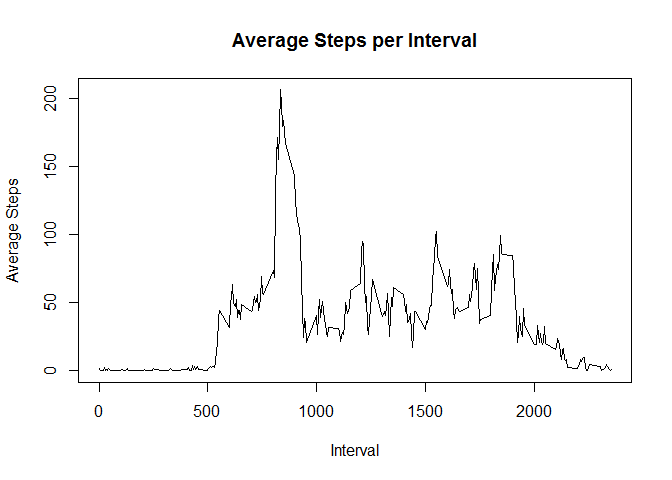

# Reproducible Research: Peer Assessment 1


## Loading and preprocessing the data

```r
#Read in data
data<-read.csv("activity.csv")
#Remove NA's
processedData<-data[!is.na(data[,1]),]
```

## What is mean total number of steps taken per day?

```r
totalData<-aggregate(steps ~ date,processedData,sum)
hist(totalData[,2],main="Frequency of Total Steps in a Day",xlab="Total steps")
```

<!-- -->

```r
#2.Calculate and report the mean and median total number of steps taken per day
meanAndMedian<-c(mean(totalData[,2]),median(totalData[,2]))
#Mean steps:
print(meanAndMedian[1])
```

```
## [1] 10766.19
```

```r
#Median steps:
print(meanAndMedian[2])
```

```
## [1] 10765
```
## What is the average daily activity pattern?

```r
#Mean steps for each interval
meanData<-aggregate(steps ~ interval,processedData,mean)
plot(x=meanData$interval,y=meanData$steps,type="l", main="Average Steps per Interval", xlab="Interval",ylab="Average Steps")
```

<!-- -->

```r
#5-minute interval (x-axis) and the average number of steps taken, averaged across all days (y-axis)
topAvg<-meanData[meanData[,2]==max(meanData[,2]),1]
#Max average steps over all intervals
print(topAvg)
```

```
## [1] 835
```
## Imputing missing values

To fill in missing values, I took the median for that interval across all the days and put that in for that missing value.

```r
#1.Calculate and report the total number of missing values in the dataset (i.e. the total number of rows with  NA s)
numNa<-sum(is.na(data[,1]))
#3.Create a new dataset that is equal to the original dataset but with the missing data filled in.
imputedData<-data
for(y in 1:nrow(imputedData)){
    if(is.na(imputedData[y,1])){
        imputedData[y,1]<-meanData[meanData$interval==imputedData[y,3],2]
    }
}
```

## Are there differences in activity patterns between weekdays and weekends?

```r
totalImData<-aggregate(steps ~ date,imputedData,sum)
hist(totalImData[,2],main="Frequency of Total Steps in a Day",xlab="Total steps")
```

<!-- -->

The histogram shows a slight movement towards the mean, mostly the values didn't change, but there seemed to be
entire days that were NA so those being set to the mean obviously made the data converge to the mean. 


```r
dayTemp<-weekdays(as.Date(imputedData$date))
for(y in 1:length(dayTemp)){
    if(dayTemp[y] !="Sunday" && dayTemp[y] !="Saturday"){ 
        imputedData[y,"dayType"] <- "weekday"
    }
    else{
        imputedData[y,"dayType"] <- "weekend"
    }
}
options(warn=-1)
library(ggplot2)
options(warn=1)
##Avg over intercals
weekDayData<-aggregate(steps ~ interval + dayType,imputedData[imputedData[,4]=="weekday",],mean)
weekEndData<-aggregate(steps ~ interval + dayType,imputedData[imputedData[,4]=="weekend",],mean)

dat<-rbind(weekDayData,weekEndData)
qplot(interval,steps,data=dat,facets =.~dayType,geom="path")+geom_line()+facet_wrap(~dayType)
```

<!-- -->

```r
summary(weekDayData)
```

```
##     interval        dayType              steps        
##  Min.   :   0.0   Length:288         Min.   :  0.000  
##  1st Qu.: 588.8   Class :character   1st Qu.:  2.247  
##  Median :1177.5   Mode  :character   Median : 25.803  
##  Mean   :1177.5                      Mean   : 35.611  
##  3rd Qu.:1766.2                      3rd Qu.: 50.854  
##  Max.   :2355.0                      Max.   :230.378
```

```r
summary(weekEndData)
```

```
##     interval        dayType              steps        
##  Min.   :   0.0   Length:288         Min.   :  0.000  
##  1st Qu.: 588.8   Class :character   1st Qu.:  1.241  
##  Median :1177.5   Mode  :character   Median : 32.340  
##  Mean   :1177.5                      Mean   : 42.366  
##  3rd Qu.:1766.2                      3rd Qu.: 74.654  
##  Max.   :2355.0                      Max.   :166.639
```

Weekdays have a higher max, but weekends have a higher mean and median
